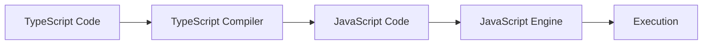

# 🎯 1.1 Introducción a TypeScript

> **Duración:** 2 horas | **Nivel:** Principiante

## 📋 Objetivos de la Lección

Al finalizar esta lección, podrás:

- ✅ Explicar qué es TypeScript y su propósito
- ✅ Identificar las ventajas de TypeScript sobre JavaScript
- ✅ Comprender el ecosistema moderno de TypeScript
- ✅ Conocer los casos de uso principales de TypeScript

---

## 🤔 ¿Qué es TypeScript y por qué usarlo?

### 📖 Definición

**TypeScript** es un superset de JavaScript desarrollado por Microsoft que añade **tipado estático opcional** y otras características avanzadas al lenguaje. Se compila a JavaScript puro, lo que significa que puede ejecutarse en cualquier entorno donde JavaScript funcione.

```typescript
// JavaScript
function greet(name) {
    return "Hello, " + name;
}

// TypeScript
function greet(name: string): string {
    return "Hello, " + name;
}
```

### 🏗️ Historia y Evolución

| Año | Versión | Características Principales |
|-----|---------|----------------------------|
| 2012 | 0.8 | Primera versión pública |
| 2014 | 1.0 | Primera versión estable |
| 2016 | 2.0 | Null checks estrictos |
| 2018 | 3.0 | Project references |
| 2020 | 4.0 | Variadic tuple types |
| 2023 | 5.0 | Decorators, const type parameters |
| 2024 | 5.8+ | **Versión actual** - Mejoras en performance |

### 🎯 ¿Por qué usar TypeScript?

#### 1. **Detección Temprana de Errores**

```typescript
// ❌ Error detectado en tiempo de desarrollo
function calculateArea(width: number, height: number): number {
    return width * height;
}

calculateArea("10", "20"); // Error: Argument of type 'string' is not assignable to parameter of type 'number'
```

#### 2. **Mejor Experiencia de Desarrollo**

- **IntelliSense mejorado**: Autocompletar más preciso
- **Refactoring seguro**: Cambios en toda la base de código
- **Navegación de código**: Ir a definición, encontrar referencias

#### 3. **Documentación Viva**

```typescript
interface User {
    id: number;
    name: string;
    email: string;
    isActive: boolean;
}

// El tipo documenta la estructura esperada
function createUser(userData: User): User {
    return userData;
}
```

#### 4. **Escalabilidad**

- Perfecto para proyectos grandes y equipos
- Facilita el mantenimiento a largo plazo
- Reduce bugs en producción

### 🌟 Ventajas Clave

| Ventaja | JavaScript | TypeScript |
|---------|------------|------------|
| **Tipado** | Dinámico | Estático opcional |
| **Errores** | En runtime | En desarrollo |
| **IDE Support** | Básico | Avanzado |
| **Refactoring** | Manual | Automatizado |
| **Documentación** | Separada | Integrada |
| **Learning Curve** | Baja | Media |

---

## 🔍 Diferencias Clave con JavaScript

### 1. **Sistema de Tipos**

```javascript
// JavaScript - Sin información de tipos
function processData(data) {
    return data.map(item => item.value * 2);
}
```

```typescript
// TypeScript - Con información de tipos
interface DataItem {
    id: number;
    value: number;
    label: string;
}

function processData(data: DataItem[]): number[] {
    return data.map(item => item.value * 2);
}
```

### 2. **Compilación vs Interpretación**



## 🌐 Ecosistema Moderno de TypeScript

### 🔧 Herramientas del Ecosistema

#### **Compiladores y Runtimes**

- **TSC**: Compilador oficial de TypeScript
- **Bun**: Runtime moderno con soporte nativo para TypeScript
- **Deno**: Runtime con TypeScript first-class

#### **Frameworks Populares**

- **React**: Con TypeScript para UI components
- **Next.js**: Framework de React con TS integrado
- **Angular**: Construido con TypeScript
- **Vue 3**: Soporte completo para TypeScript
- **Express**: Con tipos para Node.js

#### **Herramientas de Desarrollo**

- **Biome**: Linter y formatter moderno
- **Prettier**: Formatter de código
- **ESLint**: Linting con reglas TypeScript
- **Jest**: Testing framework con soporte TS

### 🚀 Casos de Uso en el Mundo Real

#### 1. **Aplicaciones Web Empresariales**

- Grandes equipos de desarrollo
- Bases de código extensas
- Necesidad de mantenibilidad

#### 2. **APIs y Backend Services**

- Node.js con Express y TypeScript
- Validación de datos
- Documentación automática

#### 3. **Aplicaciones Frontend**

- React/Vue/Angular con TypeScript
- State management tipado
- Props y eventos tipados

#### 4. **Bibliotecas y Frameworks**

- Distribución con tipos incluidos
- Mejor experiencia para desarrolladores
- API más robustas

---

## 🏢 Empresas que Usan TypeScript

### Tech Giants

- **Microsoft** - Creador y principal usuario
- **Google** - Angular y otros proyectos internos
- **Facebook** - Partes de React y herramientas internas
- **Netflix** - Aplicaciones web y herramientas internas

### Startups y Scale-ups

- **Slack** - Aplicación web y desktop
- **Airbnb** - Plataforma web principal
- **Spotify** - Web player y herramientas internas
- **Discord** - Cliente web y aplicaciones

---

## 🎯 Cuándo Usar TypeScript

### ✅ **Recomendado para:**

- 📈 **Proyectos grandes** con múltiples desarrolladores
- 🔧 **Aplicaciones complejas** con lógica de negocio compleja
- 📚 **Bibliotecas públicas** que otros desarrolladores usarán
- 🚀 **Productos a largo plazo** que necesitan mantenibilidad
- 👥 **Equipos nuevos** en JavaScript que quieren más estructura

### ⚠️ **Considera alternativas para:**

- 🚀 **Prototipos rápidos** o MVPs simples
- 👤 **Proyectos personales pequeños** (aunque puede ser buena práctica)
- ⏰ **Deadlines muy ajustados** sin tiempo para setup
- 🎓 **Equipos sin experiencia** en sistemas de tipos

---

## 🔧 Configuración Rápida (Preview)

En las próximas lecciones veremos esto en detalle, pero aquí tienes un vistazo:

```bash
# Con Bun (moderno y rápido)
bun create typescript my-app
cd my-app
bun install

# Ejecutar TypeScript directamente
bun run index.ts
```

```typescript
// index.ts
interface Greeting {
    message: string;
    timestamp: Date;
}

function createGreeting(name: string): Greeting {
    return {
        message: `Hello, ${name}! Welcome to TypeScript`,
        timestamp: new Date()
    };
}

const greeting = createGreeting("Developer");
console.log(greeting);
```

---

## 📚 Recursos para Profundizar

### 📖 Documentación Oficial

- [TypeScript Handbook](https://www.typescriptlang.org/docs/)
- [TypeScript Playground](https://www.typescriptlang.org/play)
- [Release Notes](https://devblogs.microsoft.com/typescript/)

### 🎓 Cursos y Tutoriales

- [TypeScript Deep Dive](https://basarat.gitbook.io/typescript/)
- [Execute Program - TypeScript](https://www.executeprogram.com/courses/typescript)

### 🛠️ Herramientas

- [TS Config](https://www.typescriptlang.org/tsconfig)
- [DefinitelyTyped](https://definitelytyped.org/)

---

## ✅ Resumen de la Lección

### 🎯 Puntos Clave

1. **TypeScript es JavaScript con superpoderes** - Añade tipado estático opcional
2. **Mejor experiencia de desarrollo** - Detección temprana de errores, IntelliSense mejorado
3. **Perfecto para proyectos grandes** - Escalabilidad y mantenibilidad
4. **Ecosistema robusto** - Integración con frameworks modernos
5. **Adoptado por grandes empresas** - Probado en producción a gran escala

### 🔄 Próximos Pasos

En la siguiente lección aprenderemos cómo **configurar el entorno de desarrollo** con las herramientas más modernas del ecosistema.

---

## 🤔 Preguntas de Repaso

1. ¿Cuáles son las 3 principales ventajas de TypeScript sobre JavaScript?
2. ¿En qué se diferencia el tipado estático del dinámico?
3. ¿Cuándo recomendarías usar TypeScript en un proyecto?
4. ¿Qué empresas conoces que usen TypeScript?

---

[⬅️ Volver al Módulo](./README.md) | [➡️ Siguiente: Configuración del Entorno](./02-configuracion-entorno.md)
